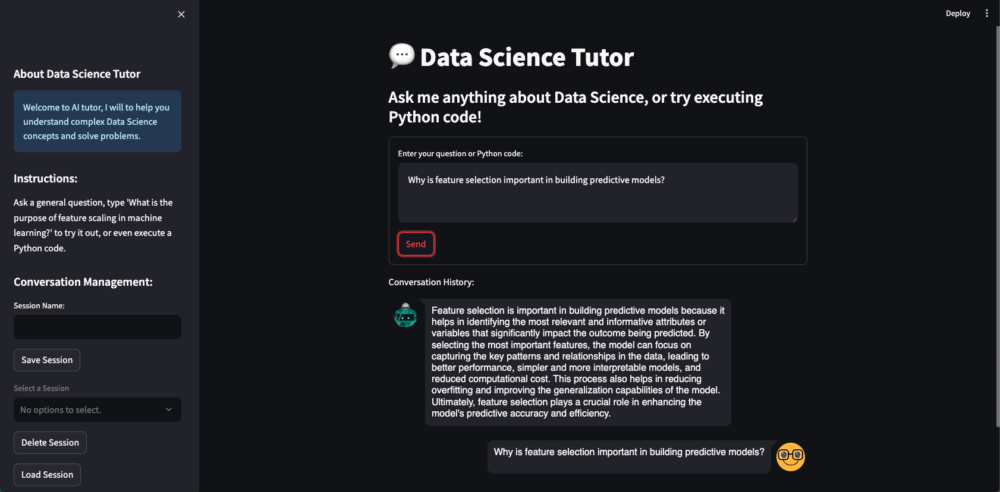

# Data Science Tutor

Data Science Tutor is a responsive and interactive AI-driven chat interface built with Streamlit and powered by OpenAI's GPT-3.5 Turbo model. It offers users the capability to engage in dynamic conversations, manage conversation history, and provide assistance to students.

## YouTube Video Demonstration
[Watch the video demonstration of Data Science Tutor](https://youtu.be/H_FGLDSlMwQ)

## Chatbot Interface

<p align="center">
  
</p>

## Key Features
- **Interactive Chat Interface**: Allows users to ask questions and receive detailed, context-aware responses about data science concepts or Python code execution.
- **Session State Management**: Tracks and manages user conversations within the session, enabling features like saving and reloading conversations.
- **Conversation Management**: Provides tools to save, load, or delete conversations, giving users control over their chat histories.

## System Requirements
- Python 3.x
- Streamlit
- OpenAI Client
- LangChain

## Installation

### Setup OpenAI API Key
Create a file named `.streamlit/secrets.toml` and paste your OpenAI API key:
```toml
[secrets]
OPENAI_API_KEY = "your_openai_api_key_here"
```
## Usage
### Running the Application

Navigate to the project directory and run the following command:

```
streamlit run main.py
```
### Interacting with the ChatBot
- **Starting a New Conversation**: Type your question or command in the provided text area and hit 'Send'.
- **Managing Conversations**: Use the sidebar to save, load, or delete conversations. Conversations can be named for easy retrieval.
- **Python Code Execution**: Type your Python code in the text area, and the chatbot will execute it and return the output.

### Sample Queries
- "What is the purpose of feature scaling in machine learning?"
- "Explain the difference between supervised and unsupervised learning."
- "Execute the following Python code: `print('Hello, World!')`"


## Contributing
Developers can extend this project by adding more specialized commands, improving the AI's response accuracy, or integrating additional AI models. 

Contributions are welcome! Please fork the repository and submit pull requests with your enhancements. 


## About Data Science Tutor
Data Science Tutor leverages advanced AI techniques to provide insightful and actionable responses, aiming to enhance the user experience through technology. It's a versatile tool for anyone looking to explore AI capabilities in conversation management.


